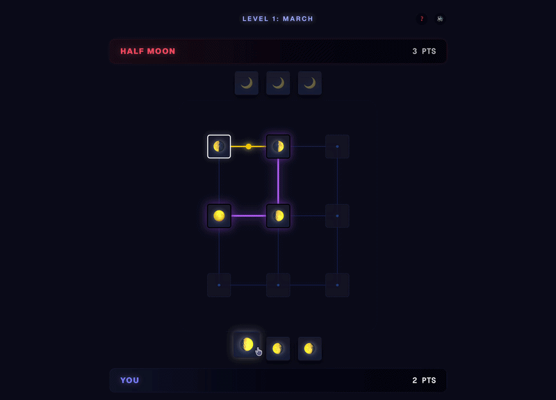

# 🌜 Rise of Halfmoon

> Strategic moon phase card game - Battle the Half Moon

A card game where you connect moon phases to score points. Match same phases, create lunar cycles, and outsmart your opponent!

This project is a clone coding of the Google Doodle Moon game.  
I am a big fan of the Google Doodle Moon game, so I decided to recreate it myself.

Original game:  
https://doodles.google/doodle/rise-of-the-half-moon/

## 🎮 Gameplay Preview

## 🎴 Game Rules

### Scoring Methods

**1. Phase Pair (1 point)**
- Match two identical moon phases
- Example: 🌒 + 🌒

**2. Full Moon Pair (2 points)**
- Match opposite phases that form a full moon
- Example: 🌒 + 🌖

**3. Lunar Cycle (N points)**
- Connect 3+ cards in phase order
- Score = number of cards in chain
- Example: 🌑 → 🌒 → 🌓 = 3 points

### Special Rules
- **Chain Steal**: Opponent can steal your chain by adding to it
- **Card Bonus**: +1 point per card you control at game end

## 🛠 Tech Stack

- Next.js 15
- TypeScript
- Framer Motion
- Tailwind CSS

---

*Connect the cosmos, one phase at a time* 🌙
